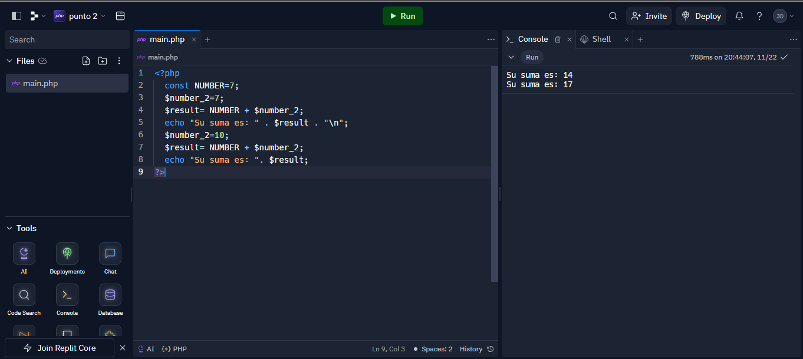

<h1>Taller 10 - Jorge Elian Guio Gonzalez</h1>

<h2>Información</h2>

Curso: Full stack basico grupo 1

Profesor: Cristian Patiño

<h2>Punto 1: Constantes y Variables</h2>

<h2>Punto 2: Suma de Constantes y Variables</h2>

<h2>Punto 3: Suma de dos números indicados por el usuario</h2>

<h2>Punto 4: Datos del usuario en consola</h2>

<h2>Punto 5: Entrada de bolera usando if/else</h2>

<h2>Punto 6: Detección de mayoria de edad</h2>

<h2>Punto 7: Seleccion de operacion aritmetica</h2>

<h2>Punto 8: Entrada a la bolera usando switch case</h2>

<h2>Punto 9: Tabla de multiplicar usando while</h2>

<h2>Punto 10: Numero pares usando while</h2>

<h2>Punto 11: Numero impares usando for</h2>

<h2>Punto 12: Tabla de multiplicar usando for</h2>

<h2>Punto 13: Suma de valores de un arreglo con foreach</h2>

<h2>Punto 14: Revision de contraseña</h2>

<h2>Punto 15: Seleccion de operacion aritmetica usando funciones</h2>